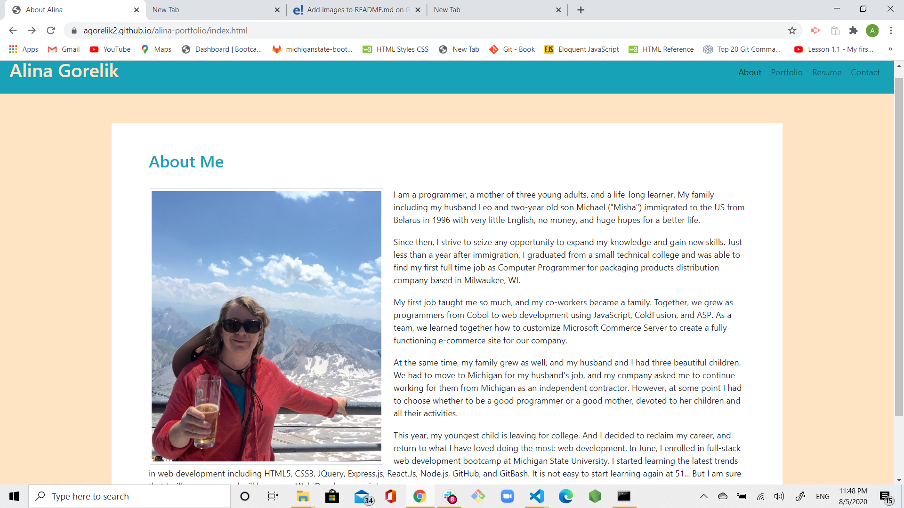
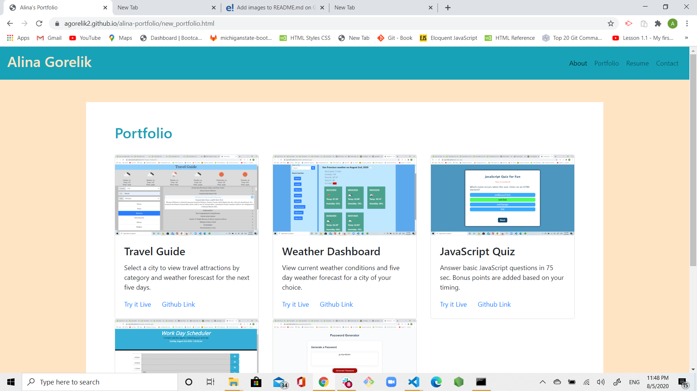

# alina-portfolio

# Unit 08 Project 1 Homework: Professional Materials

## Link to Portfolio:

[portfolio link](https://agorelik2.github.io/alina-portfolio/)

## Link to Repo:

[portfolio repo link](https://github.com/agorelik2/alina-portfolio)

## Pictures of my Portfolio site

## Additions

- Updated portfolio featuring project 1 and 4 of my homework assignments.

- Updated GitHub profile with pinned repositories featuring project 1 and two exemplary assignments.

- Updated resume

- Updated LinkedIn profile

### Updated Portfolio

My updated portfolio site has the following content:

- My name

- Links to my GitHub profile & LinkedIn page as well as my email address and phone number

- A link to a PDF of my resume

- A list of projects. For each project, there is:

  - Project title

  - Link to the deployed version

  - Link to the GitHub repository

  - Screenshot of the deployed application

#### Design

- Mobile-first design

- Chose a color palette for my site so it doesn't just look like
  the default bootstrap theme or an unstyled HTML site.

### Updated GitHub Profile

- Update the following in my GitHub profile:

  - Profile picture

  - Bio

  - Location

  - Email

  - Link to your portfolio

    * Pinned some repos that you want to highlight

### Updated Resume

There is a new navigation link to \*.pdf file with my resume

### Updated LinkedIn Profile

Updated my LinkedIn Profile with a bio statement, a professional photo, and links to my Github and portfolio.
